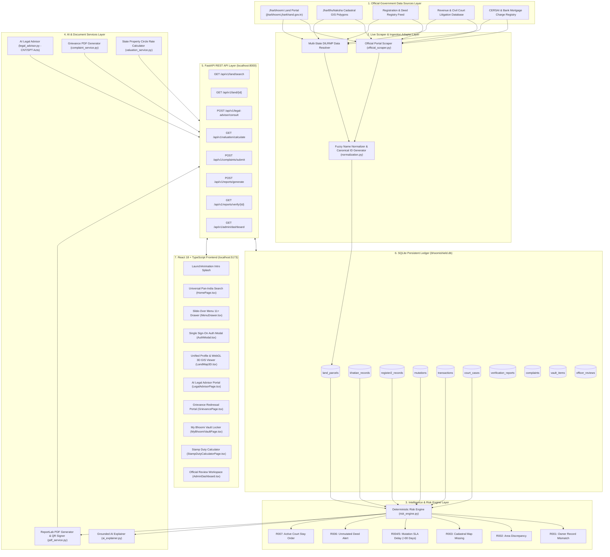
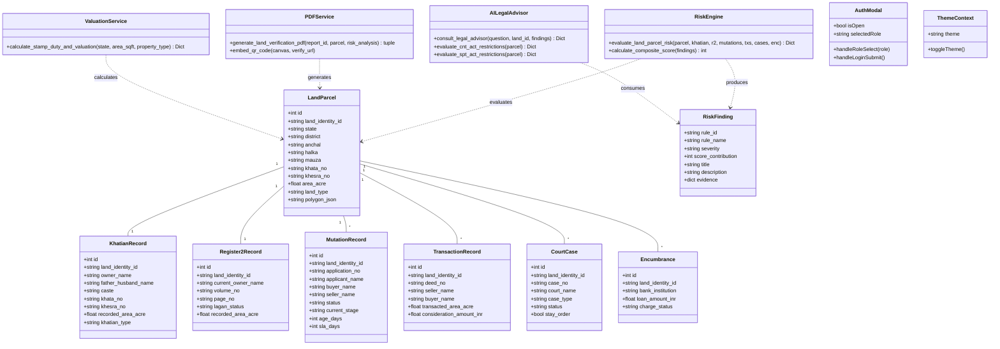
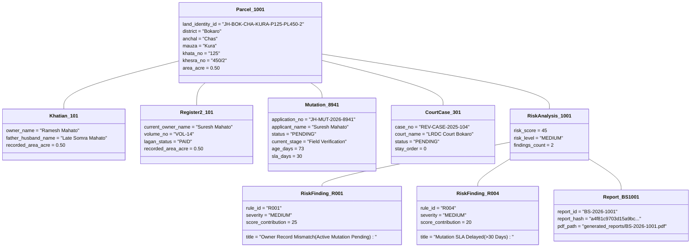

# BhoomiShield System Architecture & UML Design Document

This document presents the complete system working architecture, class diagram, runtime object diagram, and data flow specifications for the **BhoomiShield** platform.

---

## 🏗️ 1. System Working Architecture Diagram

BhoomiShield follows a multi-tier, decoupled Digital Public Infrastructure (DPI) architecture:

---

## 📐 2. System Class Diagram

The class diagram outlines domain entity models, core analytical engines, AI advisors, service modules, and frontend state controllers:

---

## 🔮 3. Runtime Object Diagram (Instantiation Snapshot)

Snapshot of an active runtime object graph for parcel `JH-BOK-CHA-KURA-P125-PL450-2` in Chas, Bokaro:

---

## ⚙️ 4. End-to-End System Execution & Data Flow

### Step 1: Pan-India Search & Canonical ID Resolution
1. The citizen enters search parameters (State, District, Khata, Khesra, or Owner Name) on the `HomePage` or `LandSearchPage`.
2. The `normalization.py` module constructs a canonical Land Identity ID:
   $$\text{LandIdentityID} = \text{StateCode}-\text{DistCode}-\text{AnchalCode}-\text{MauzaCode}-\text{Khata}-\text{Khesra}$$
3. Live adapters query `jharbhoomi.jharkhand.gov.in` and Digital India DILRMP streams in real-time.

### Step 2: Deterministic Risk Engine Evaluation (Rules R001–R007)
The `risk_engine.py` runs deterministic validation rules:
- **R001**: Compares `Khatian.owner_name` vs `Register2.current_owner_name`. If names differ and no mutation is filed, adds **35 points (HIGH)**. If an active mutation is pending, adds **25 points (MEDIUM)**.
- **R002**: Compares `Khatian.recorded_area_acre` vs `Register2.recorded_area_acre`. Discrepancies $>0.05$ acres add **15 points**.
- **R003**: Checks for missing GeoJSON polygon coordinates in JharBhuNaksha.
- **R004/R005**: Checks if `Mutation.age_days > 30`. Delays add **20 points**.
- **R006**: Flags unmutated sale deeds where buyer differs from current tenant roll.
- **R007**: Flags active Revenue/Civil Court stay orders (**40 points (HIGH)**).

Composite Risk Score Calculation:
$$\text{Composite Score} = \min\left(100, \sum_{i=1}^{n} \text{Finding Score}_i\right)$$

- **$0 - 29$**: `LOW RISK` (Green 🟢)
- **$30 - 69$**: `MEDIUM RISK` (Amber 🟡)
- **$70 - 100$**: `HIGH RISK` (Red 🔴)

### Step 3: Grounded AI Legal Counsel & WebGL 3D Mapping
- `legal_advisor.py` checks tribal land transfer prohibitions under **Chota Nagpur Tenancy (CNT) Act 1908 Section 46/71A** and **Santhal Parganas Tenancy (SPT) Act 1949 Section 20**.
- `LandMap3D.tsx` parses plot polygon coordinates and renders a WebGL 3D extruded land parcel with 360° terrain topography controls.

### Step 4: Anti-Tamper QR PDF Report Generation
- `pdf_service.py` compiles the certified verification PDF.
- Computes SHA-256 digital signature hash:
  $$\text{Hash} = \text{SHA256}(\text{LandID} \parallel \text{Score} \parallel \text{Timestamp})$$
- Embeds a QR code linking to `/verify/{report_id}`.

### Step 5: Revenue Officer Review Workflow
- Officers authenticate via `AuthModal.tsx` (`OFFICER GATE`).
- `AdminDashboard.tsx` presents flagged cases for Circle Officer & LRDC review.
- Officers submit signed decisions (`REQUIRE_FIELD_VERIFICATION`, `CITIZEN_CLARIFICATION`, `DISMISS`, `ESCALATE`) which are recorded in `officer_reviews` and `audit_logs`.
