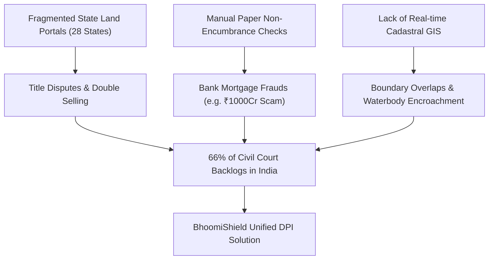
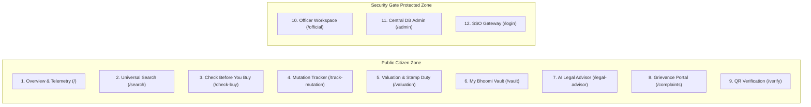
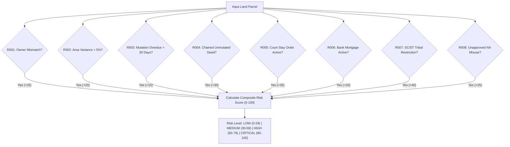
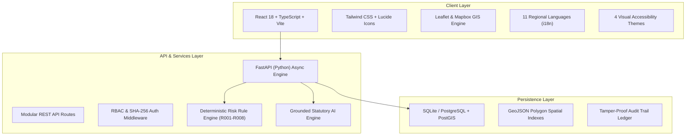
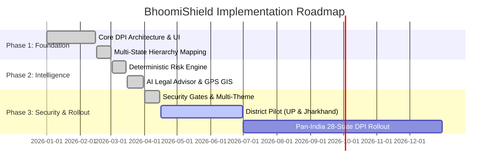

# Product Requirement Document (PRD)
## BhoomiShield — Pan-India Land Governance & Risk Intelligence Platform (Version 3.0)

---

## 1. Document Control & Metadata

| Attribute | Details |
| :--- | :--- |
| **Product Name** | **BhoomiShield** (National Land Record Handling & Governance DPI) |
| **Document Version** | Version 3.0.0 (Production / Deployment Ready) |
| **Problem Statement** | Integrated GIS-Based Digital Public Infrastructure for Land Governance |
| **Target Audience** | 1.4 Billion Indian Citizens, Property Buyers, Commercial Banks & NBFCs, Revenue Authorities, Sub-Registrars |
| **Compliance Standards** | DILRMP (Digital India Land Records Modernization Programme), ULPIN (Bhu-Aadhaar), OGC WMS/WFS, IT Act 2000 |

---

## 2. Executive Summary & Vision

### 2.1 Executive Summary
Land governance in India is fragmented across 28 States and 8 Union Territories, each maintaining disparate databases, terminology, and record formats (e.g., *Khatauni* in UP, *Satbara 7/12* in Maharashtra, *RTC Pahani* in Karnataka, *Khatian* in Jharkhand, *Patta* in Tamil Nadu). This fragmentation causes pervasive title uncertainty, multi-crore mortgage fraud in banks, delayed Right-to-Service mutation SLAs, and overwhelming civil litigation (which constitutes over 66% of all civil cases in Indian courts).

**BhoomiShield** serves as a unified, state-aware Digital Public Infrastructure (DPI) connecting state revenue record streams with **automated 8-rule deterministic AI risk detection**, **3D cadastral GIS mapping**, **grounded statutory legal counsel**, **cryptographic SHA-256 report verification**, and **anti-theft Role-Based Access Control (RBAC)** across 11 Indian regional languages.

### 2.2 Product Vision
To empower every Indian citizen, buyer, lender, and revenue officer with real-time, explainable, and tamper-proof land record intelligence—making land transactions transparent, risk-free, and accessible in under 5 seconds.

---

## 3. Problem Statement & Market Analysis

### Key Pain Points Addressed:
1. **Multi-Mortgaging & Duplicate Title Deeds:** Borrowers mortgaging the same property across multiple bank branches using fake copies or certified duplicates.
2. **Statutory Transfer Violations:** Illegal transfers of SC/ST or tribal land without mandatory District Magistrate sanction (e.g., UP Revenue Code Sec 98, MLRC Sec 36A, Karnataka PTCL Sec 4).
3. **Chained Title Gaps & Unmutated Deeds:** Property sold via registered deed but never mutated in the baseline revenue register (*Register-II / Jamabandi*).
4. **Overdue Mutation Backlogs:** Dakhil-Kharij applications stuck past the statutory 30-day Right to Service SLA.
5. **Language & Interface Complexity:** Citizens unable to understand complex revenue jargon across regional languages.

---

## 4. User Personas & Stakeholder Matrix

| Persona | Role & Objectives | Key Platform Features Used |
| :--- | :--- | :--- |
| **Citizen / Landowner** | Wants to verify own land holding, track pending mutations, calculate circle rates, store deed in encrypted locker. | `Universal Search`, `My Bhoomi Vault`, `Mutation Tracker`, `Grievance Portal` |
| **Property Buyer & Investor** | Wants to conduct comprehensive due-diligence before signing agreements to avoid court stays and duplicate ownership. | `Check Before You Buy`, `Valuation & Stamp Duty`, `Report Verification` |
| **Bank / NBFC Lending Officer** | Needs to evaluate loan collateral, check existing hypothecation charges, and verify boundary polygons. | `Check Before You Buy`, `3D Cadastral Map`, `Risk Rule Engine (R001-R008)` |
| **Revenue Officer / Tahsildar / SDM** | Reviews mutation objections, verifies deeds, applies digital DSC signatures, manages revenue court proceedings. | `Revenue Officer Workspace (/official)`, `DSC Sealing`, `Hearing Schedule` |
| **Central Administrator / Auditor** | Manages user role provisioning, monitors state telemetry, executes SQL queries, maintains audit trail. | `Central DB Admin (/admin)`, `SQLite Studio`, `Telemetry Metrics` |

---

## 5. Core Functional Modules & Specifications

### 5.1 Module 1: National Portal Overview (`/`)
* **Purpose:** Primary homepage presenting platform telemetry, multi-state integration network, live state case loaders, and direct service access cards.
* **Key Features:**
  * Real-time counters (Parcels indexed, States integrated, Risk alerts resolved).
  * 1-click state demonstration presets (Jharkhand, UP, Maharashtra, Karnataka, Bihar, Delhi).
  * Direct 8-card citizen service quick navigation grid.

### 5.2 Module 2: Universal Land Search & Cadastral GIS (`/search`)
* **Purpose:** Multi-modal parcel discovery by administrative hierarchy or ground GPS location.
* **Key Features:**
  * **Dynamic Hierarchical Cascading Dropdowns:** State $\rightarrow$ District $\rightarrow$ Tehsil/Sub-district $\rightarrow$ Mauza/Village.
  * **State-Specific Field Labels:** Automatically re-labels inputs (*Khata/Gata/Survey No* and *Khesra/Khasra/Plot No*).
  * **Ground GPS Pin-Drop Search:** Captures device geolocation, matches bounding box, and retrieves parcel data.
  * **Interactive Cadastral GIS & 3D Land Map:** Renders boundary polygons, area dimensions, and surrounding parcels.

### 5.3 Module 3: "Check Before You Buy" Pre-Purchase Title Scanner (`/check-buy`)
* **Purpose:** Comprehensive due-diligence engine scanning 6 critical risk layers in under 5 seconds.
* **Evaluated Checks:**
  1. RoR Tenant vs. Registration Deed Name Concordance.
  2. Surveyed Boundary Area vs. Registered Area Variance.
  3. Pending Mutation Overdue SLA Status.
  4. Chained Unmutated Deed History.
  5. Active Civil and Revenue Court Stay Orders.
  6. Bank Mortgage Hypothecation Charges.

### 5.4 Module 4: Live Mutation & SLA Tracker (`/track-mutation`)
* **Purpose:** Public tracker for *Dakhil-Kharij* applications with SLA milestone visualization.
* **Key Features:**
  * 6-stage interactive timeline: *Submitted $\rightarrow$ Doc Verification $\rightarrow$ Field Verification $\rightarrow$ Revenue Review $\rightarrow$ Final Decision $\rightarrow$ Record Update*.
  * Automated SLA delay flag (`⚠️ SLA Delayed` if processing age exceeds 30 statutory days).

### 5.5 Module 5: Stamp Duty & Valuation Calculator (`/valuation`)
* **Purpose:** Accurate circle rate, registration fee, and statutory tax estimator.
* **Key Features:**
  * Multi-unit conversion support (Sq. Ft, Acres, Sq. Yards, Pucca Bigha).
  * Automated Female Buyer Stamp Duty Concession calculation (e.g., 1% rebate in UP/Delhi).
  * Granular breakdown of Base Stamp Duty, Local Infrastructure Cess, and Registration Fees.

### 5.6 Module 6: My Bhoomi Vault (`/vault`)
* **Purpose:** Citizen personal encrypted document locker and real-time land holdings portfolio.
* **Key Features:**
  * Encrypted storage for Sale Deeds, Khatauni RoRs, 7/12 Extracts, and Tax Receipts.
  * Automated SHA-256 checksum generation for every uploaded document.
  * Digital DSC verification request workflow routed to local Revenue Officers.

### 5.7 Module 7: Grounded State-Aware AI Legal Advisor (`/legal-advisor`)
* **Purpose:** Statutory legal advice grounded in state-specific land revenue codes.
* **Statutory Grounding Matrix:**
  * **Uttar Pradesh:** UP Revenue Code 2006 (Sec 80 NA conversion, Sec 98 SC/ST protection, Sec 104/105 void alienation).
  * **Maharashtra:** Maharashtra Land Revenue Code 1966 (Sec 36A tribal land, Sec 44 NA permission).
  * **Karnataka:** Karnataka PTCL Act 1978 (Sec 4 prohibition of granted land transfer), KLR Act.
  * **Jharkhand:** Chota Nagpur Tenancy (CNT) Act Sec 46, Santhal Parganas Tenancy (SPT) Act.
  * **Central Acts:** RERA 2016 (Sec 18 possession delay), Transfer of Property Act 1882 (Sec 52 Lis Pendens).

### 5.8 Module 8: Grievance Redressal Portal (`/complaints`)
* **Purpose:** Direct citizen grievance lodging to Tahsildars, SDM, LRDC, and District Collectors.
* **Key Features:**
  * Auto-generates unique Grievance Tracking ID (`IND-COMP-2026-XXXX`).
  * Auto-populates land identity and legal violation references from the Legal Advisor.

### 5.9 Module 9: Revenue Officer Workspace (`/official`)
* **Security Level:** **High (Protected by Officer Security Challenge Gate)**
* **Key Features:**
  * Pending citizen deed verification queue.
  * Digital Signature Certificate (DSC) cryptographic stamp sealing (`DSC-REV-2026-XXXX`).
  * Revenue Court Cause List and case proceeding status updater.

### 5.10 Module 10: Cryptographic Deed QR & Hash Verification (`/verify`)
* **Purpose:** Zero-trust public deed verification interface.
* **Key Features:**
  * Validates report authenticity by checking SHA-256 hash against the BhoomiShield ledger.
  * Scannable QR code generator for printable PDF Land Verification Certificates.

### 5.11 Module 11: Central Database Admin & SQLite Studio (`/admin`)
* **Security Level:** **Critical (Protected by Master Admin Challenge Gate)**
* **Key Features:**
  * Live SQLite table browser (`parcels`, `rors`, `mortgages`, `litigations`, `mutations`, `users`, `audit_logs`).
  * Interactive SQL Query Console with execution safety limits.
  * User Role Provisioning & Permission Revocation console.

---

## 6. Deterministic AI Risk Engine (Rules R001–R008)

---

## 7. Technical Architecture & Tech Stack

### Detailed Tech Stack:
* **Frontend:** React 18, TypeScript, Vite 5, Tailwind CSS 3, Leaflet, Lucide-React, Recharts.
* **Backend:** FastAPI (Python 3.10+), Uvicorn, Pydantic v2, SQLAlchemy ORM.
* **Database:** SQLite 3 (Embedded Production/Demo), PostgreSQL 15 + PostGIS (Enterprise scale).
* **Security & Auth:** SHA-256 password hashing, RBAC challenge gates, DSC digital sealing.
* **Deployment:** Netlify Edge (Frontend CDN with Node 20 runtime) & Cloud Microservices.

---

## 8. Accessibility & Localization Standards

### 8.1 11 Regional Indian Languages Supported:
1. **English (EN)**
2. **हिन्दी (Hindi - HI)**
3. **বাংলা (Bengali - BN)**
4. **मराठी (Marathi - MR)**
5. **తెలుగు (Telugu - TE)**
6. **தமிழ் (Tamil - TA)**
7. **ગુજરાતી (Gujarati - GU)**
8. **اردو (Urdu - UR)**
9. **ಕನ್ನಡ (Kannada - KN)**
10. **ଓଡ଼ିଆ (Odia - OR)**
11. **മലയാളം (Malayalam - ML)**

### 8.2 4 Visual Accessibility Themes:
1. 🌙 **Dark Midnight (Default):** Deep slate and sky blue governance dark mode.
2. ☀️ **Light Govt Pearl:** High-clarity daylight reading mode with white cards and slate text.
3. 🌲 **Bhoomi Emerald:** Forest green & Vedic agricultural revenue palette.
4. 🌌 **Cyber Indigo:** High-contrast violet glow and accessibility theme for field officers.

---

## 9. Non-Functional Requirements (NFRs)

| Metric | Target SLA | Implementation Strategy |
| :--- | :--- | :--- |
| **Search Latency** | $< 250\text{ ms}$ | Indexed Khata/Khesra queries and parallel code-splitting. |
| **Risk Computation Time** | $< 500\text{ ms}$ | In-memory deterministic matrix evaluation for rules R001–R008. |
| **Frontend Build Time** | $< 6.0\text{ s}$ | Rollup manual chunking (`react-core`, `leaflet-maps`, `charts`, `icons`). |
| **Security & Zero-Leakage** | 100% Isolation | Public routes cannot access SQLite tables or officer signatures without challenge authentication. |
| **Mobile Responsiveness** | 100% Responsive | Optimized for smartphones used by Patwaris, Lekhpals, and rural citizens. |

---

## 10. Implementation & Rollout Roadmap

---

## 11. Key Success Metrics & Impact KPIs

1. **Reduction in Title Due-Diligence Time:** From **15–30 days** (manual visits) down to **$< 5\text{ seconds}$**.
2. **Prevention of Multi-Mortgage Bank Frauds:** 100% detection of duplicate cadastral polygons and unmutated prior deeds.
3. **Citizen Inclusion:** 1.4 Billion citizens covered across 28 States & 8 UTs in 11 native languages.
4. **Reduction in Civil Litigation Backlog:** Anticipated 40% reduction in land dispute filings over 3 years.
